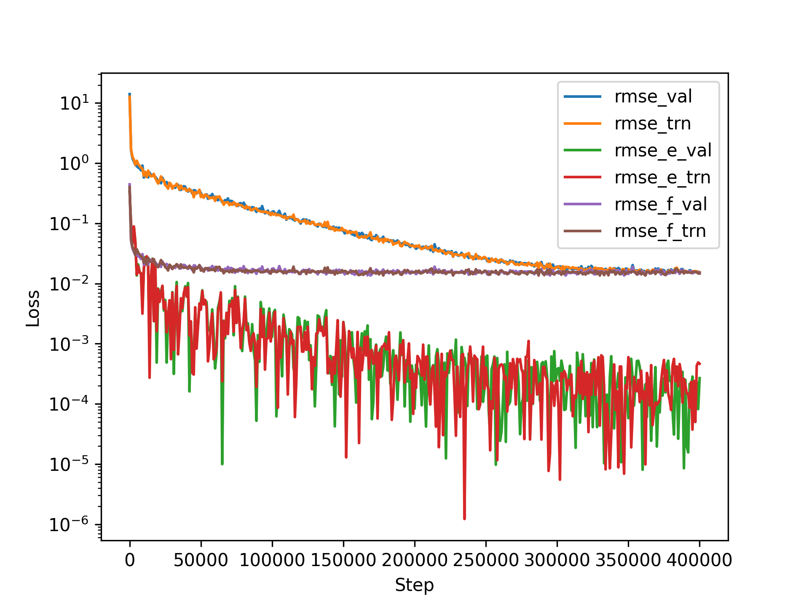
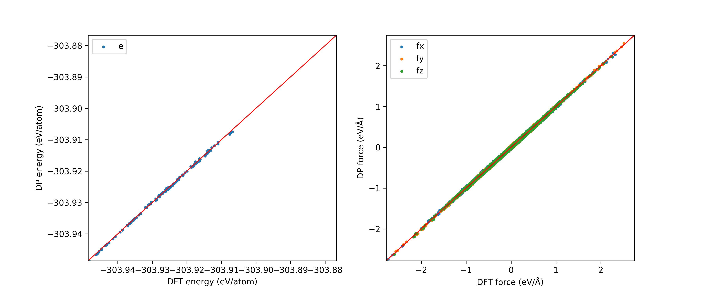
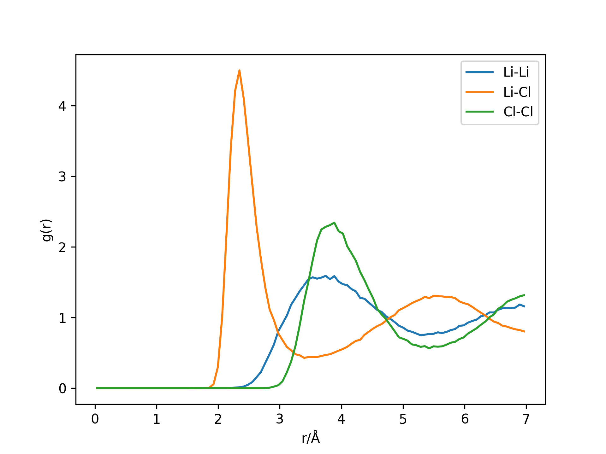

# DeePMD-kit 深度势能（DP）模型训练

对于LiCl熔体，我们可以使用DeePMD-kit软件包，为其训练一个深度势能模型。DeePMD-kit是一个基于深度学习的分子动力学模拟工具，可以根据第一性原理数据训练高精度的DP模型。在这个示例中，我们可以利用ABACUS 第一性原理数据和DeePMD-kit训练一个LiCl熔体的DP模型。

## 目的

学习完本课程后你应该：

- 掌握DeePMD-kit输入文件编写
- 能够进行数据准备、训练/冻结/压缩/测试和分子动力学任务


## 资源

在本教程中，我们以LiCl熔体分子为例,训练深度势能模型。我们已经在`work/ex3`中准备了需要的文件。
 
```bash
wget --content-disposition https://github.com/LiangWenshuo1118/LiCl/raw/main/work.tar.gz
tar zxvf work.tar.gz
```

在work/ex3文件夹下有00.data，01.train和02.lmp3个子文件夹。
- 00.data 文件夹用于存放训练和测试数据，
- 01.train 包含使用 DeePMD-kit 训练模型的示例脚本，
- 02.lmp 包含用于分子动力学模拟的 LAMMPS 示例脚本。

本教程采用 DeePMD-kit(2.1.5)程序完成。

## 练习 

### 数据准备

在ex2/01.md中已经执行了ABACUS MD计算。我们在00.data下提供了一个名为data.py的Python脚本，其中调用 [dpdata](https://github.com/deepmodeling/dpdata) 的工具，将ABACUS MD生成的数据（数据格式abacus/md）转换DeePMD-kit 的压缩格式（numpy数组）。data.py脚本内容如下:

```python
import dpdata 
import numpy as np

#加载abacus/md格式数据
data = dpdata.LabeledSystem('../../ex2/01.md', fmt = 'abacus/md')        

# 随机选择100个索引，用于生成验证集;其他的索引，用于生成测试集
index_validation = np.random.choice(len(data),size=100,replace=False)    
index_training = list(set(range(len(data)))-set(index_validation)) 

创建子数据集：训练集,测试集      
data_training = data.sub_system(index_training)                          
data_validation = data.sub_system(index_validation) 
# 导出训练集,测试集（deepmd/npy格式）                     
data_training.to_deepmd_npy('training_data')                                                       
data_validation.to_deepmd_npy('validation_data')                         

print('# the data contains %d frames' % len(data))     
print('# the training data contains %d frames' % len(data_training)) 
print('# the validation data contains %d frames' % len(data_validation))
```

进入00.data文件夹执行data.py文件:
```bash
 $ cd 00.data
 $ python data.py
```

我们可以看到 01.md 文件包含 501 帧数据。 我们随机选取 100 帧作为验证数据，其余的401帧作为训练数据。在开始训练之前，我们可以先检查training_data或validation_data文件夹。

```bash
$ ls training_data
set.000 type.raw type_map.raw
```
1. set.000：是一个目录，包含压缩格式的数据（numpy压缩数组）。
2. type.raw：是一个文件，包含原子的类型（以整数表示）。
3. type_map.raw：是一个文件，包含原子的类型名称。

```bash
$ cat training_data/type.raw 
0 0 0 0 0 0 0 0 0 0 0 0 0 0 0 0 0 0 0 0 0 0 0 0 0 0 0 0 0 0 0 0 1 1 1 1 1 1 1 1 1 1 1 1 1 1 1 1 1 1 1 1 1 1 1 1 1 1 1 1 1 1 1 1
```
由于系统中的所有帧都具有相同的原子类型和原子序号，因此我们只需为整个系统指定一次类型信息。

```bash
$ cat training_data/type_map.raw 
Li Cl
```
其中原子 Li 被赋予类型 0，原子 Cl 被赋予类型 1。


### DP模型训练
#### 准备输入脚本 

数据准备完成后，接下来就可以进行训练。进入训练目录：

```bash
$ cd ../01.train
$ ls 
input.json
```
input.json包含了DP模型训练过程中所需的各种参数，定义和控制训练任务。这些参数在DeePMD-kit手册中有详细的解释，所以这里只做简单介绍。

在model模块, 指定嵌入和拟合网络的参数。
```
    "model":{
    "type_map":    ["Li", "Cl"],                         # 元素名称
    "descriptor":{
        "type":            "se_e2_a",                    # 描述符类型
        "rcut":            7.00,                         # 截止半径
        "rcut_smth":       0.50,                         # 光滑截止半径
        "sel":             [128, 128],                   # 原子的选定邻居数
        "neuron":          [20, 40, 80],                 # 嵌入网络尺寸
        "resnet_dt":       false,
        "axis_neuron":     12,                           # 嵌入子网络横向尺寸
        "seed":            1,
        "_comment":        "that's all"
    },
    "fitting_net":{
        "neuron":          [200, 200, 200],              # 拟合网络尺寸
        "resnet_dt":       true,
        "seed":            1,
        "_comment":        "that's all"
    },
    "_comment":    "that's all"'
},
```
描述符se\_e2\_a用于DP模型的训练。将嵌入和拟合神经网络的大小分别设置为 [20, 40, 80] 和 [200, 200, 200]。 $\tilde{\mathcal{R}}^{i}$里的成分会从0.5到7Å平滑地趋于0。

下面的参数指定学习效率和损失函数：
```
    "learning_rate" :{
        "type":                "exp",
        "decay_steps":         5000,                      # 学习率下降间隔
        "start_lr":            0.001,                     # 起始学习率   
        "stop_lr":             3.51e-8,                   # 结束学习率 
        "_comment":            "that's all"
    },
    "loss" :{
        "type":                "ener",
        "start_pref_e":        0.02,                      # 能量起始权重
        "limit_pref_e":        1,                         # 能量最终权重
        "start_pref_f":        1000,                      # 力起始权重
        "limit_pref_f":        1,                         # 力最终权重
        "start_pref_v":        0,                         # 维里
        "limit_pref_v":        0,
        "_comment":            "that's all"
    },
```
在损失函数中，$\text{pref\_e}$从0.02逐渐增加到1 $\text{eV}^{-2}$，而$\text{pref\_f}$从1000逐渐减小到1 $\text{\AA}^2 \mathrm{eV}^{-2}$，这意味着力项在开始时占主导地位，而能量项和维里项在结束时变得重要。这种策略非常有效，并且减少了总训练时间。$\text{pref\_v}$设为0 $\text{eV}^{-2}$，这表明训练过程中不包含任何维里数据。将起始学习率、停止学习率和衰减步长分别设置为0.001，3.51e-8，和5000。模型训练步数为$10^6$。


训练参数如下：
```
    "training" : {
        "training_data": {
            "systems":            ["../00.data/training_data"],         # 训练数据路径
            "batch_size":         "auto",                               # 自动确定，natoms*batch_size≥32
            "_comment":           "that's all"
        },
        "validation_data":{
            "systems":            ["../00.data/validation_data/"],
            "batch_size":         "auto",				
            "numb_btch":          1,                                    # 测试帧数
            "_comment":           "that's all"
        },
        "numb_steps":             400000,                               # 训练步数
        "seed":                   10,
        "disp_file":              "lcurve.out",                         # 写入学习曲线到文件
        "disp_freq":              1000,                                 # 写入学习曲线的频率
        "save_freq":              10000,                                # 保存模型相关文件频率
    },
```
#### 模型训练

准备好训练脚本后，我们可以用DeePMD-kit开始训练，只需运行

```bash
$ dp train input.json
```

在train.log可以看到数据系统的信息
```
DEEPMD INFO      ----------------------------------------------------------------------------------------------------
DEEPMD INFO      ---Summary of DataSystem: training     -------------------------------------------------------------
DEEPMD INFO      found 1 system(s):
DEEPMD INFO                              system        natoms        bch_sz        n_bch          prob        pbc
DEEPMD INFO           ../00.data/training_data/            64             1          401         1.000          T
DEEPMD INFO      -----------------------------------------------------------------------------------------------------
DEEPMD INFO      ---Summary of DataSystem: validation   --------------------------------------------------------------
DEEPMD INFO      found 1 system(s):
DEEPMD INFO                               system       natoms        bch_sz        n_bch          prob        pbc
DEEPMD INFO          ../00.data/validation_data/           64             1          100         1.000          T
```
以及本次训练的开始和最终学习率
```
DEEPMD INFO      start training at lr 1.00e-03 (== 1.00e-03), decay_step 5000, decay_rate 0.950006, final lr will be 3.51e-08
```
如果一切正常，将在屏幕上看到每 1000 步打印一次的信息，例如
```
DEEPMD INFO    batch    1000 training time 14.99 s, testing time 0.01 s
DEEPMD INFO    batch    2000 training time 13.36 s, testing time 0.01 s
DEEPMD INFO    batch    3000 training time 13.37 s, testing time 0.00 s
DEEPMD INFO    batch    4000 training time 13.32 s, testing time 0.01 s
DEEPMD INFO    batch    5000 training time 13.28 s, testing time 0.01 s
DEEPMD INFO    batch    6000 training time 13.21 s, testing time 0.00 s
DEEPMD INFO    batch    7000 training time 13.50 s, testing time 0.00 s
DEEPMD INFO    batch    8000 training time 13.30 s, testing time 0.00 s
DEEPMD INFO    batch    9000 training time 13.35 s, testing time 0.00 s
DEEPMD INFO    batch   10000 training time 13.30 s, testing time 0.00 s
```
 在第 10000 步结束时，模型保存在 TensorFlow 的检查点文件 model.ckpt 中。 同时，训练和测试错误显示在文件 lcurve.out 中。
```bash
$ cat lcurve.out
#  step      rmse_val    rmse_trn    rmse_e_val  rmse_e_trn    rmse_f_val  rmse_f_trn         lr
      0      1.41e+01    1.27e+01      3.50e-01    3.35e-01      4.45e-01    4.02e-01    1.0e-03
...
 399000      1.57e-02    1.55e-02      8.17e-05    4.88e-04      1.53e-02    1.47e-02    4.0e-08
 400000      1.55e-02    1.54e-02      2.68e-04    4.64e-04      1.51e-02    1.47e-02    3.5e-08
```
第 4、5 和 6、7 卷分别介绍了能量和力量训练和测试错误。 经过 1000,000 步训练，能量测试误差小于 1 meV，力测试误差小于 20 meV/Å。可以通过简单的Python脚本对该文件进行可视化：

```python
import numpy as np
import matplotlib.pyplot as plt

data = np.genfromtxt("lcurve.out", names=True)
for name in data.dtype.names[1:-1]:
    plt.plot(data['step'], data[name], label=name)
plt.legend()
plt.xlabel('Step')
plt.ylabel('Loss')
plt.yscale('log')
plt.savefig('lcurve.png',dpi=300)
```



当训练过程异常停止时，我们可以从提供的检查点重新开始训练，只需运行

```bash
$ dp train  --restart model.ckpt  input.json
```
需要注意的是 input.json 需要和上一个保持一致。

#### 冻结和压缩模型
在训练结束时，保存在 TensorFlow 的 checkpoint 文件中的模型参数通常需要冻结为一个以扩展名 .pb 结尾的模型文件。 只需执行
```
$ dp freeze -o licl.pb
...
DEEPMD INFO    1142 ops in the final graph.
```
它将在当前目录中输出一个名为 graph.pb 的模型文件。 压缩 DP 模型通常会将基于 DP 的计算速度提高一个数量级，并且消耗更少的内存。 licl.pb 可以通过以下方式压缩：
```
$ dp compress -i licl.pb -o licl-compress.pb
DEEPMD INFO    stage 1: compress the model
DEEPMD INFO    training data with lower boundary: [-0.24458911 -0.24716975]
DEEPMD INFO    training data with upper boundary: [10.09208968 10.29813619]
...
DEEPMD INFO    finished compressing    

DEEPMD INFO    stage 2: freeze the model
...
DEEPMD INFO    Restoring parameters from model-compression/model.ckpt
DEEPMD INFO    778 ops in the final graph.
```
将输出一个名为licl-compress.pb 的模型文件。

#### 模型测试
我们可以通过运行如下命令检查训练模型的质量
```bash
$ dp test -m licl-compress.pb -s ../00.data/validation_data -n 100 -d results
```
在屏幕上，可以看到验证数据的预测误差信息 
```
DEEPMD INFO    # number of test data : 100 
DEEPMD INFO    Energy RMSE        : 1.742981e-02 eV
DEEPMD INFO    Energy RMSE/Natoms : 2.723408e-04 eV
DEEPMD INFO    Force  RMSE        : 1.556867e-02 eV/A
DEEPMD INFO    Virial RMSE        : 2.974961e+00 eV
DEEPMD INFO    Virial RMSE/Natoms : 4.648376e-02 eV
DEEPMD INFO    # ----------------------------------------------- 
```
它将在当前目录中输出名为 results.e.out 和 results.f.out 的文件。类似地，可以通过简单的Python脚本对该文件进行可视化：

```python
import numpy as np
import matplotlib.pyplot as plt

# 定义绘制散点图和对角线的函数
def plot(ax, data, key, xlabel, ylabel, min_val, max_val):
    data_key = f'data_{key}'
    pred_key = f'pred_{key}'
    ax.scatter(data[data_key], data[pred_key], label=key, s=6)
    ax.legend()
    ax.set_xlabel(xlabel)
    ax.set_ylabel(ylabel)
    ax.set_xlim(min_val, max_val)
    ax.set_ylim(min_val, max_val)
    ax.plot([min_val, max_val], [min_val, max_val], 'r', lw=1)

# 读取数据，并对e数据进行原子化处理
natom = 64
data_e = np.genfromtxt("results.e.out", names=["data_e", "pred_e"])
data_f = np.genfromtxt("results.f.out", names=["data_fx", "data_fy", "data_fz", "pred_fx", "pred_fy", "pred_fz"])

for col in ['data_e', 'pred_e']:
    data_e[col] /= natom

# 计算e和f的最小值和最大值
data_e_stacked = np.column_stack((data_e['data_e'], data_e['pred_e']))
data_f_stacked = np.column_stack((data_f['data_fx'], data_f['data_fy'], data_f['data_fz'], data_f['pred_fx'], data_f['pred_fy'], data_f['pred_fz']))

min_val_e, max_val_e = np.min(data_e_stacked), np.max(data_e_stacked)
min_val_f, max_val_f = np.min(data_f_stacked), np.max(data_f_stacked)

# 绘制散点图并保存结果
fig, axs = plt.subplots(1, 2, figsize=(12, 5))
plot(axs[0], data_e, 'e', 'DFT energy (eV/atom)', 'DP energy (eV/atom)', min_val_e, max_val_e)
for force_direction in ['fx', 'fy', 'fz']:
    plot(axs[1], data_f, force_direction, 'DFT force (eV/Å)', 'DP force (eV/Å)', min_val_f, max_val_f)
plt.savefig('DP&DFT.png', dpi=300)

```



### 使用LAMMPS运行MD 

现在让我们切换到 02.lmp 目录。

```bash
$ cd ../02.lmp
```

首先，我们将01.train目录中的DP模型复制到当前目录

```bash
$ cp ../01.train/licl-compress.pb ./
```

02.lmp目录下有三个文件

```bash
$ ls
conf.lmp  licl-compress.pb  in.licl
```

其中 conf.lmp 给出了LiCl熔体 MD 模拟的初始配置，文件 in.licl 是 lammps 输入脚本。 可以检查 in.licl 并发现它是一个用于 MD 模拟的相当标准的 LAMMPS 输入文件，与ex1中的 in.licl 文件相比，在原子类型和势函数参数设置上略有不同：

```bash
atom_style  atomic
```
和

```bash
pair_style  licl-compress.pb
pair_coeff  * *
```

其中调用pair style deepmd并提供模型文件licl-compress.pb，这意味着原子间相互作用将由名为licl-compress.pb的DP模型计算。可以以标准方式执行

```bash
$ lmp  -i  in.licl
```

稍等片刻，MD模拟结束，生成log.lammps和licl.dump文件。 它们分别存储热力学信息和分子的轨迹，我们可以使用ex1中提供的Python脚本ave_rdf.py计算RDF。

```bash
$ python ave_rdf.py
```


